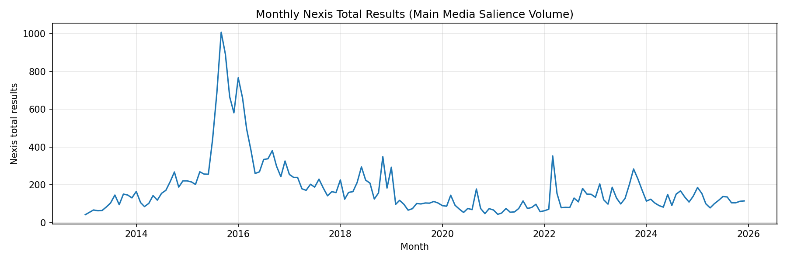
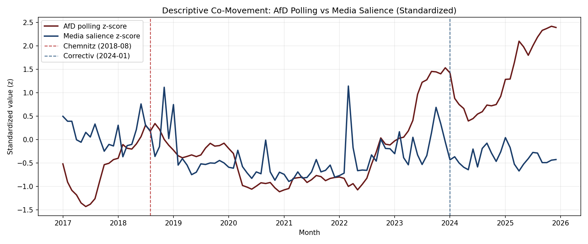

---
title: "Media Salience and Framing Shocks:"
subtitle: "Text-Based Indicators of AfD-Relevant Coverage and Public Support in Germany A presentation for conferral of a Master of Science in Data Science for Society and Business"
author: "Trifanov Matvei"
date: "2026-05-29"
date-format: "DD.MM.YYYY"
---

## 1. Why This Case Matters & Why AfD {.section-divider}
- AfD is a major right-wing populist party in Germany
- Its support is tightly linked to issue environments
  migration/asylum, security/public order, national identity, far-right mobilization, democratic legitimacy
- These domains are repeatedly activated in public debate and are measurable in text

## Why Shocks Matter

- These issue environments do not rise as smooth trends
- Salience often jumps after sudden events, scandals, and revelations
- This creates analytically useful windows where media attention and framing can shift quickly
- Design transition:
  from AfD as case to shock-based comparison

## Core Puzzle

- More AfD-relevant coverage does not mechanically imply more AfD support
- Working puzzle:
  `Media attention ↑ ≠ AfD support ↑ automatically`

  
More coverage

  
→

  
Framing

  
→

  
Tone

  
→

  
Context

  
→

  
Different political outcomes

## Why This Is a Data Science Problem {.ds-problem-slide}

::: {.ds-problem-layout}
::: {.ds-problem-grid}
::: {.ds-problem-card}
**Text-as-data measurement**  
Large-scale extraction of issue signals from article text.
:::
::: {.ds-problem-card}
**Reproducible pipeline**  
From raw retrieval and cleaning to monthly indicators.
:::
::: {.ds-problem-card}
**Panel alignment**  
Media indicators aligned with monthly AfD polling.
:::
::: {.ds-problem-card}
**Mechanism comparison**  
Event-window design to compare shock-specific dynamics.
:::
:::

  
Articles

  
→

  
Indicators

  
→

  
Monthly panel

  
→

  
Shock windows

  
→

  
Interpretation

:::

## Research Question

- **How do major AfD-relevant media shocks differ in salience and framing, and how do these differences align with later AfD polling dynamics?**
- Sub-question:
  Which issue-specific indicator shifts are most visible around each shock window?
- Contribution:
  a comparable cross-shock evidence framework linking media indicators to polling dynamics

## Why These Three Shocks? Selection and Exogenous Timing {.shock-selection-slide}

::: {.columns}
::: {.column width="33%"}
::: {.shock-card}
**Cologne / Silvesternacht**  
31 Dec 2015; info shock 4-5 Jan 2016  
Trigger: sudden violent event  
Timing external to monthly polling series
:::
:::
::: {.column width="33%"}
::: {.shock-card}
**Chemnitz**  
26-27 Aug 2018  
Trigger: sudden violent event  
Timing external to monthly polling series
:::
:::
::: {.column width="33%"}
::: {.shock-card}
**Correctiv revelation**  
10 Jan 2024  
Trigger: external journalistic revelation  
Timing external to monthly polling series
:::
:::
:::

- Not routine campaign events or ordinary monthly fluctuations.
- Not selected because polling moved afterward; treated as credible temporal anchors for descriptive pre/post comparison.

::: {.shock-takeaway}
Selected because they are sudden, externally timed, nationally visible, and not chosen based on later polling movement.
:::

## Three Shocks, Three Mechanisms {.shock-mechanism-slide}

| Shock | Main mechanism activated | Expected empirical pattern |
|---|---|---|
| Cologne | migration / security / public order | salience spike, security framing rise, AfD support up |
| Chemnitz | security / far-right mobilization | framing shift, limited net polling response |
| Correctiv | remigration / democracy-threat / legitimacy | remigration/far-right spike, AfD support down |

- Comparative logic: shocks activate different mechanisms, not one uniform pathway.
- Evaluation axis across all three cases: salience, framing, tone, and polling movement.

## Timeline {background-iframe="afd_research_design_timeline.html" background-interactive="true" .timeline-background-only}

## 2. Data Architecture Overview {.section-divider}

Three empirical blocks:

1. German news corpus
2. AfD polling panel
3. Shock / event-window framework

| Component | Scope |
|---|---|
| Media corpus | 2013-01 to 2025-12 |
| Kept articles | 9,367 |
| Polling panel | 2013-09 to 2025-12 |
| Monthly observations | 148 |
| Shocks | 3 |

## Main Corpus vs Shock Corpora {.corpus-logic-slide}

::: {.corpus-flow}
::: {.corpus-card}
**Main corpus**  
Long-run AfD-relevant media environment (2013-01 to 2025-12).  
Tracks baseline salience and framing context.
:::
::: {.corpus-arrow}
→
:::
::: {.corpus-card}
**Shock windows**  
Local event-centered comparison around each shock.  
Isolates short-horizon pre/post shifts.
:::
::: {.corpus-arrow}
→
:::
::: {.corpus-card}
**Polling panel**  
Monthly AfD support series (2013-09 to 2025-12).  
Aligns media indicators with political outcomes.
:::
:::

::: {.corpus-takeaway}
Main corpus provides context, shock windows provide local contrasts, and polling panel provides outcome alignment.
:::

## Nexis Query Logic {.query-logic-slide}

- Operational definition: AfD-relevant media environment as overlap across issue domains.

::: {.query-bubble-grid}
::: {.query-bubble}
Migration / asylum
:::
::: {.query-bubble}
Security / public order
:::
::: {.query-bubble}
AfD / far-right
:::
::: {.query-bubble}
Remigration / democracy-threat
:::
:::

::: {.query-core}
Query captures issue visibility patterns, not only explicit party mentions.
:::

- Full Boolean query text is in the appendix.

## Pipeline {.pipeline-slide}

{.pipeline-hero}

Nexis retrieval -> cleaning/deduplication -> monthly salience -> text indicators -> polling merge -> event-window diagnostics.

## Salience: What It Measures {.salience-slide}

- Salience = monthly Nexis total relevant results.
- Not the same as downloaded article count.
- Kept-article counts are used for text-indicator construction.
- Coverage volume alone does not explain political pattern differences.

{.salience-hero}

## Text-Based Indicators: How They Are Constructed {.indicator-construction-slide}

- Count issue-dictionary terms in each article.
- Normalize by article length.
- Aggregate to monthly indicators.

Formula (per article):

$$
\text{terms per 1,000 words}
=
\left(\frac{\text{dictionary term count}}{\text{word count}}\right)\times 1000
$$

::: {.indicator-build-flow}
::: {.ib-step}
Article text
:::
::: {.ib-arrow}
→
:::
::: {.ib-step}
Dictionary counts
:::
::: {.ib-arrow}
→
:::
::: {.ib-step}
Length normalization
:::
::: {.ib-arrow}
→
:::
::: {.ib-step}
Monthly aggregation
:::
:::

## Text-Based Indicators: What They Capture {.indicator-family-slide}

::: {.indicator-family-grid}
::: {.indicator-family-card}
Migration
:::
::: {.indicator-family-card}
Security / public-order
:::
::: {.indicator-family-card}
AfD / far-right
:::
::: {.indicator-family-card}
Remigration / democracy-threat
:::
::: {.indicator-family-card}
Negative / threat
:::
::: {.indicator-family-card}
Supplementary tone proxy
:::
:::

- Goal: compare how issue emphasis and tone differ across shocks.

## Event-Window Logic: +/-3 and +/-6 Months {.window-logic-slide}

- +/-3 months: tighter local comparison.
- +/-6 months: broader descriptive window.
- Goal is comparison of local pre/post patterns at two scales, not one exact effect estimate.

::: {.window-timeline}
  
±6 window

  
±3 window

  

  

  

  

  

  

  
-6

  
-3

  
0 (shock)

  
+3

  
+6

:::
## Bridge to Act 3

- With salience, framing indicators, and polling in one aligned monthly panel, we can compare how each shock maps to distinct media-political dynamics.

{.chart-image}

## Three Shocks {.section-divider}

## Cologne

- Placeholder: shock-specific mechanism slide scaffold

{.chart-image}

## Chemnitz

- Placeholder: shock-specific mechanism slide scaffold

{.chart-image}

## Correctiv

- Placeholder: shock-specific mechanism slide scaffold

{.chart-image}

## Comparative Synthesis {.section-divider}

## Comparative Synthesis

- Placeholder: cross-shock pattern comparison
- Placeholder: consistency / heterogeneity across indicators
- Placeholder: implications for interpretation

{.chart-image}

## Limitations {.section-divider}

## Limitations

- Placeholder: measurement and data limitations
- Placeholder: design limitations and sensitivity boundaries
- Placeholder: external validity considerations

## Conclusion {.section-divider}

## Conclusion

- Placeholder: concise takeaways
- Placeholder: theoretical and empirical contribution
- Placeholder: next steps for full thesis write-up

## Appendix {.section-divider}

## Appendix

- Placeholder: extra robustness visuals
- Placeholder: indicator construction details
- Placeholder: supplementary notes and backup slides

