---
title: "Media Salience and Framing Shocks:"
subtitle: "Text-Based Indicators of AfD-Relevant Coverage and Public Support in Germany A presentation for conferral of a Master of Science in Data Science for Society and Business"
author: "Trifanov Matvei"
date: "2026-05-29"
date-format: "DD.MM.YYYY"
---

## 1. Why This Case Matters & Why AfD {.section-divider}
- AfD is a major right-wing populist party in Germany
- Its support is tightly linked to issue environments
  migration/asylum, security/public order, national identity, far-right mobilization, democratic legitimacy
- These domains are repeatedly activated in public debate and are measurable in text

## Why Shocks Matter

- These issue environments do not rise as smooth trends
- Salience often jumps after sudden events, scandals, and revelations
- This creates analytically useful windows where media attention and framing can shift quickly
- Design transition:
  from AfD as case to shock-based comparison

## Core Puzzle

- More AfD-relevant coverage does not mechanically imply more AfD support
- Working puzzle:
  `Media attention ↑ ≠ AfD support ↑ automatically`

  
More coverage

  
→

  
Framing

  
→

  
Tone

  
→

  
Context

  
→

  
Different political outcomes

## Why This Is a Data Science Problem {.ds-problem-slide}

::: {.ds-problem-layout}
::: {.ds-problem-grid}
::: {.ds-problem-card}
**Text-as-data measurement**  
Large-scale extraction of issue signals from article text.
:::
::: {.ds-problem-card}
**Reproducible pipeline**  
From raw retrieval and cleaning to monthly indicators.
:::
::: {.ds-problem-card}
**Panel alignment**  
Media indicators aligned with monthly AfD polling.
:::
::: {.ds-problem-card}
**Mechanism comparison**  
Event-window design to compare shock-specific dynamics.
:::
:::

  
Articles

  
→

  
Indicators

  
→

  
Monthly panel

  
→

  
Shock windows

  
→

  
Interpretation

:::

## Research Question

- **How do major AfD-relevant media shocks differ in salience and framing, and how do these differences align with later AfD polling dynamics?**
- Sub-question:
  Which issue-specific indicator shifts are most visible around each shock window?
- Contribution:
  a comparable cross-shock evidence framework linking media indicators to polling dynamics

## Why These Three Shocks? Selection and Exogenous Timing {.shock-selection-slide}

::: {.columns}
::: {.column width="33%"}
::: {.shock-card}
**Cologne / Silvesternacht**  
31 Dec 2015; info shock 4-5 Jan 2016  
Trigger: sudden violent event  
Timing external to monthly polling series
:::
:::
::: {.column width="33%"}
::: {.shock-card}
**Chemnitz**  
26-27 Aug 2018  
Trigger: sudden violent event  
Timing external to monthly polling series
:::
:::
::: {.column width="33%"}
::: {.shock-card}
**Correctiv revelation**  
10 Jan 2024  
Trigger: external journalistic revelation  
Timing external to monthly polling series
:::
:::
:::

- Not routine campaign events or ordinary monthly fluctuations
- Not selected because polling moved afterward; treated as credible temporal anchors for descriptive pre/post comparison

::: {.shock-takeaway}
Selected because they are sudden, externally timed, nationally visible, and not chosen based on later polling movement
:::

## Three Shocks, Three Mechanisms {.shock-mechanism-slide}

| Shock | Main mechanism |
|---|---|
| Cologne | migration / security / public order |
| Chemnitz | security / far-right mobilization |
| Correctiv | remigration / democracy-threat / legitimacy |

- Comparative logic: shocks activate different mechanisms, not one uniform pathway
- Evaluation axis across all three cases: salience, framing, tone, and polling movement

## Timeline {background-iframe="afd_research_design_timeline.html" background-interactive="true" .timeline-background-only}

## 2. Data Architecture Overview {.section-divider}

Three empirical blocks:

1. German news corpus
2. AfD polling panel
3. Shock / event-window framework

| Component | Scope |
|---|---|
| Media corpus | 2013-01 to 2025-12 |
| Kept articles | 9,367 |
| Polling panel | 2013-09 to 2025-12 |
| Monthly observations | 148 |
| Shocks | 3 |

## Main Corpus vs Shock Corpora {.corpus-logic-slide}

::: {.corpus-flow}
::: {.corpus-card}
**Main corpus**  
Long-run AfD-relevant media environment (2013-01 to 2025-12)
Tracks baseline salience and framing context
:::
::: {.corpus-arrow}
→
:::
::: {.corpus-card}
**Shock windows**  
Local event-centered comparison around each shock
Isolates short-horizon pre/post shifts
:::
::: {.corpus-arrow}
→
:::
::: {.corpus-card}
**Polling panel**  
Monthly AfD support series (2013-09 to 2025-12). 
Aligns media indicators with political outcomes
:::
:::

::: {.corpus-takeaway}
Main corpus provides context, shock windows provide local contrasts, and polling panel provides outcome alignment
:::

## Nexis Query Logic {.query-logic-slide}

Event specific shock retrieval + main corpus data fetching

::: {.query-swap}
::: {.query-cards .query-raw .fragment .fade-out data-fragment-index="1"}
::: {.query-card .shock-query}
**Cologne**  
`(Kölner Hauptbahnhof AND Silvesternacht)`
:::
::: {.query-card .shock-query}
**Chemnitz**  
`(Chemnitz AND Ausschreitungen OR Tötungsdelikt OR Messerattacke OR Demonstrationen)`
:::
::: {.query-card .shock-query}
**Correctiv**  
`(Correctiv AND Potsdam AND Geheimtreffen)`
:::
::: {.query-card .main-query}
**Main corpus**  
`((Asyl OR Asylpolitik OR Asylbewerber OR Flüchtling! OR Abschieb! OR Zuwander! OR Einwander!)`  
`AND (Deutschland OR Bundesrepublik OR Bundesamt OR Kommune OR Kommunen OR Unterbringung OR Polizei))`  
`AND length > 250`
:::
:::

::: {.query-stage2 .fragment data-fragment-index="1"}
::: {.query-stage2-grid}
::: {.query-stage2-card .shock-logic}
**Shock queries: focused anchor-term retrieval**

- Cologne -> narrow query around a single event
- Chemnitz -> query combining location with event descriptors
- Correctiv -> query centered on the Potsdam revelation
:::
::: {.query-stage2-card .main-logic}
**Main corpus: broader data extraction**

`Migration / asylum vocabulary`  
`AND German policy / institutional context`  
`AND length > 250`  
`=> Main corpus`
:::
:::

::: {.query-core}
Shock queries isolate specific events; the main corpus captures the broader AfD-relevant issue environment
:::
:::
:::

## Pipeline {.pipeline-slide}

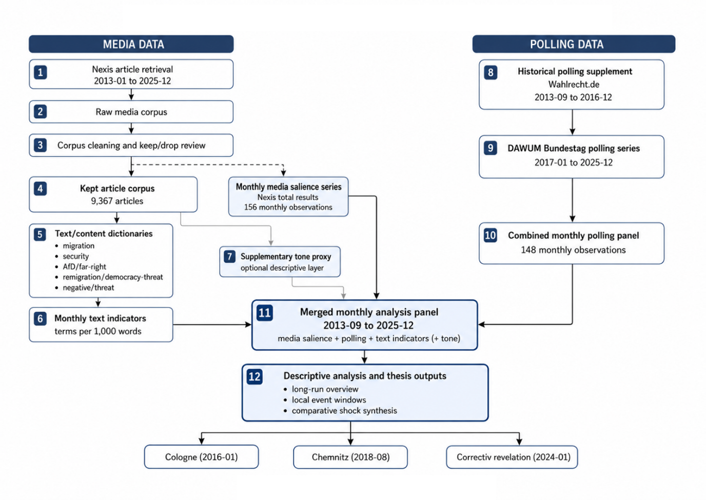{.pipeline-hero}

Nexis retrieval -> cleaning/deduplication -> monthly salience -> text indicators -> polling merge -> event-window diagnostics

## Salience: What It Measures {.salience-slide}

- Salience = monthly Nexis total relevant results*
- `*relevant results` = volume of all articles matching the main query results
- Kept-article counts are used for text indicator construction
- Coverage volume alone does not explain political pattern differences

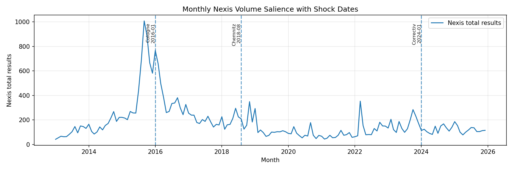{.salience-hero}

## Text-Based Indicators: How They Are Constructed {.indicator-construction-slide}

::: {.indicator-swap}
::: {.indicator-stage1 .fragment .fade-out data-fragment-index="1"}
- Count issue dictionary terms
- Normalize by article length
- Aggregate monthly

Formula (per article):

$$
\text{terms per 1,000 words}
=
\left(\frac{\text{dictionary term count}}{\text{word count}}\right)\times 1000
$$
:::

::: {.indicator-stage2 .fragment data-fragment-index="1"}
::: {.indicator-stage2-intro}
The monthly indicator is the average of article-level values within each month
:::

$$
I_m = \frac{1}{N_m}\sum_{i \in m} I_i
$$

::: {.indicator-stage2-note}
$$
\begin{aligned}
I_i &= \text{article-level normalized indicator} \\
N_m &= \text{number of articles in month } m \\
I_m &= \text{monthly indicator}
\end{aligned}
$$
:::
:::
:::

## Text-Based Indicators: What They Capture {.indicator-family-slide}

::: {.indicator-family-grid}
::: {.indicator-family-card}
Migration
:::
::: {.indicator-family-card}
Security / public-order
:::
::: {.indicator-family-card}
AfD / far-right
:::
::: {.indicator-family-card}
Remigration / democracy-threat
:::
::: {.indicator-family-card}
Negative / threat
:::
::: {.indicator-family-card}
Supplementary tone proxy
:::
:::

- `They show what kind of coverage increases around each shock - and whether the tone of that coverage also changes`

## Event-Window Logic: +/-3 and +/-6 Months {.window-logic-slide}

- Shock month is t = 0
- I compare the months before and after the shock in the monthly panel
- The comparison includes media salience, text indicators, polling support
- ±3 for a tighter local view; ±6 for a broader descriptive view

::: {.window-timeline}
  
±6 window

  
±3 window

  

  

  

  

  

  

  
-6

  
-3

  
0 (shock)

  
+3

  
+6

:::

## 3. Long-Run Context: AfD Support and Media Salience {.result-slide .act3-result-slide .section-divider}

::: {.result-takeaway}
All 3 shocks occur under different background conditions: Cologne coincides with the strongest media salience surge, while Correctiv occurs when AfD support is already at one of its highest levels
:::

::: {.act3-evidence-grid}
::: {.act3-evidence-card}
**Salience peak**  
Sep 2015: **1,007** Nexis results
:::
::: {.act3-evidence-card}
**Correctiv baseline**  
Jan 2024 AfD support: **21.34%**
:::
::: {.act3-evidence-card}
**Series high support**  
Nov 2025 AfD support: **26.02%**
:::
:::

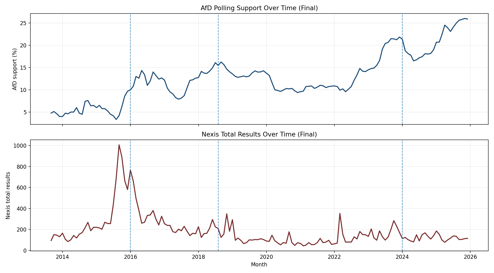{.chart-image}

## Cologne: Security Salience Surge with Later AfD Rise {.result-slide .shock-result-slide .act3-result-slide}

::: {.result-takeaway}
Cologne shows a sharp security spike, then a later rise in AfD support; salience peaks early and then declines
:::

::: {.act3-evidence-grid}
::: {.act3-evidence-card}
**Security framing at shock (t=0)**  
**16.11** terms per 1,000 words
:::
::: {.act3-evidence-card}
**AfD support change**  
**10.00% -> 11.00%** (t+6)  
Pre/post mean: **+6.49 pp**
:::
::: {.act3-evidence-card}
**Salience context**  
Local peak **1,007** at t-4 (Sep 2015)  
Shock month: **766**
:::
:::

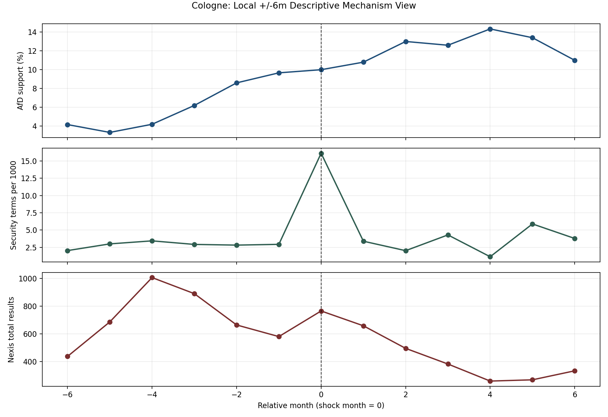{.chart-image}

## Chemnitz: Strong Security/Far-Right Movement, Different Polling Path {.result-slide .shock-result-slide .act3-result-slide}

::: {.result-takeaway}
Chemnitz produces strong security and far-right framing spikes, but these shifts are not followed by the same sustained polling rise observed after Cologne
:::

::: {.act3-evidence-grid}
::: {.act3-evidence-card}
**Security framing at shock (t=0)**  
**14.13** terms per 1,000 words
:::
::: {.act3-evidence-card}
**AfD/far-right framing peak**  
**10.61** terms per 1,000 words  
at t+1 (Sep 2018)
:::
::: {.act3-evidence-card}
**Polling movement**  
**15.46% -> 13.00%** (t+6)  
Pre/post mean: **+0.07 pp**
:::
:::

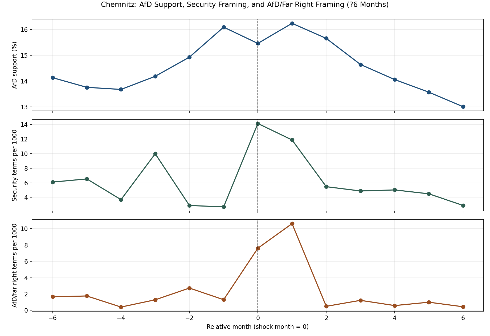{.chart-image}

## Correctiv: Adverse/Remigration Framing with AfD Decline {.result-slide .shock-result-slide .act3-result-slide}

::: {.result-takeaway}
Correctiv is the clearest case of concentrated adverse framing: remigration/democracy-threat and AfD/far-right indicators spike sharply at the shock, while AfD support declines in the following months
:::

::: {.act3-evidence-grid}
::: {.act3-evidence-card}
**Remigration/democracy-threat peak (t=0)**  
**15.84** terms per 1,000 words
:::
::: {.act3-evidence-card}
**AfD/far-right peak (t=0)**  
**18.25** terms per 1,000 words
:::
::: {.act3-evidence-card}
**AfD support decline**  
**21.34% -> 17.19%** (t+6)  
Pre/post mean: **-3.65 pp**
:::
:::

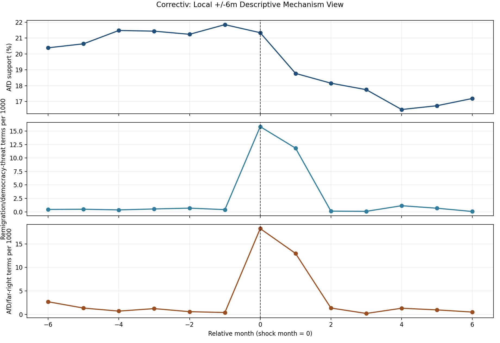{.chart-image}

## 4. Synthesis | What Emerges Across 3 Shocks {.result-slide .act3-result-slide .section-divider}

::: {.result-takeaway}
The response is not uniform: Cologne is polling positive, Correctiv is associated with negative framing and falling AfD support, Chemnitz sits between them
:::

::: {.act3-evidence-grid}
::: {.act3-evidence-card}
**AfD support change (post-pre, +/-6m)**  
Cologne: **+6.49 pp**  
Chemnitz: **+0.07 pp**  
Correctiv: **-3.65 pp**
:::
::: {.act3-evidence-card}
**Largest remigration shift (+/-6m)**  
Correctiv: **+1.84** terms per 1,000 words
:::
::: {.act3-evidence-card}
**Largest AfD/far-right shift (+/-6m)**  
Correctiv: **+1.72** terms per 1,000 words  
Chemnitz: **+0.87**
:::
:::

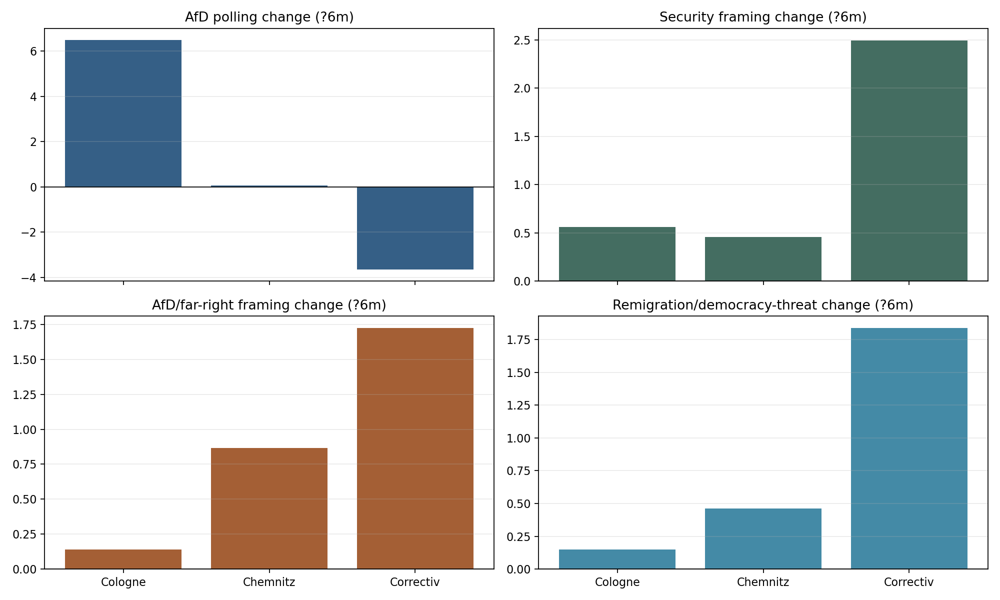{.chart-image}

## What Patterns Emerge Across Shocks

- Attention alone does not explain polling direction
- Framing explains more than raw volume
- Each shock activates a different mechanism
- Cologne and Correctiv form the clearest contrast

## Conclusion

- `Reproducible notebooks` with text as data pipeline linking retrieval, indicator construction, polling alignment, and event window comparison.
- `Empirical contribution:` AfD-relevant shocks differ not only in intensity, but in the issue environments they activate and the polling dynamics they align with.
- `Core result:` more attention does not uniformly help or hurt AfD; different shocks map onto different media-political pathways.

## Appendix / Auxilary graphs{.section-divider}

## Dictionary Families and Groups {.appendix-dictionary-slide}

Regex/stem-based matching on normalized text (umlauts transliterated; `*` below means suffix expansion via `\w*`).

| Family | Group key | Presentation label |
|---|---|---|
| issue_environment | `migration` | Migration/Asylum |
| issue_environment | `security` | Security/Public Order |
| actor_identity | `afd_far_right` | AfD/Far-right |
| mechanism_specific | `remigration_democracy` | Remigration/Democracy-threat |
| evaluative_tone_proxy | `negative_threat` | Negative/Threat |

## Dictionary Detail: All Groups {.appendix-dictionary-slide .dict-table-5-slide}

| Migration/Asylum | Security/Public Order | AfD/Far-right | Remigration/Democracy-threat | Negative/Threat |
|---|---|---|---|---|
| migrat migrant fluechtling gefluechtet asyl zuwander einwander auslaender auslaendisch abschieb deport integrat grenz schutzsuch unterkunft fluechtlingsheim aufnahm | kriminal straftat straftaeter tatverdaechtig verdaechtig polizei sicherheit gewalt messer mord totschlag vergewaltig sexuell belaestig uebergriff ausschreit randal krawall mob hetzjagd demonstrat protest ordnung rechtsstaat innere sicherheit | afd alternative fuer deutschland rechtspopul rechtsextrem rechte rechtsradikal rechtsruck identitaer pegida hoecke weidel gauland chrupalla nationalistisch voelkisch | remigration geheimtreffen potsdam correctiv deport vertreib masterplan identitaer beweg sellner rechtsextremismus demokrati verfassungsfeind verfassungsschutz parteiverbot menschenwuerd massendeport | angst sorg gefahr gefaehrlich bedroh kris eskalat chaos problem konflikt gewalt hass hetz extremismus radikal skandal schock empoer wut illegal missbrauch ueberforderung scheiter versag |

## Yearly Kept Article Totals {.appendix-figure-slide}

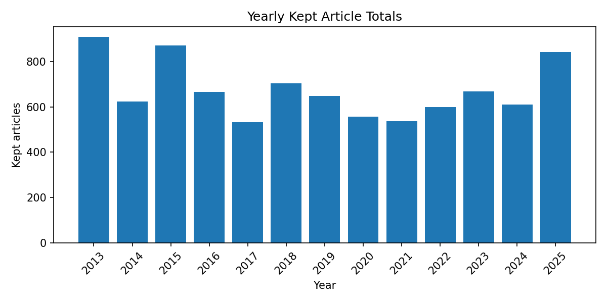{.appendix-figure}

## Word Count Distribution of Kept Articles {.appendix-figure-slide}

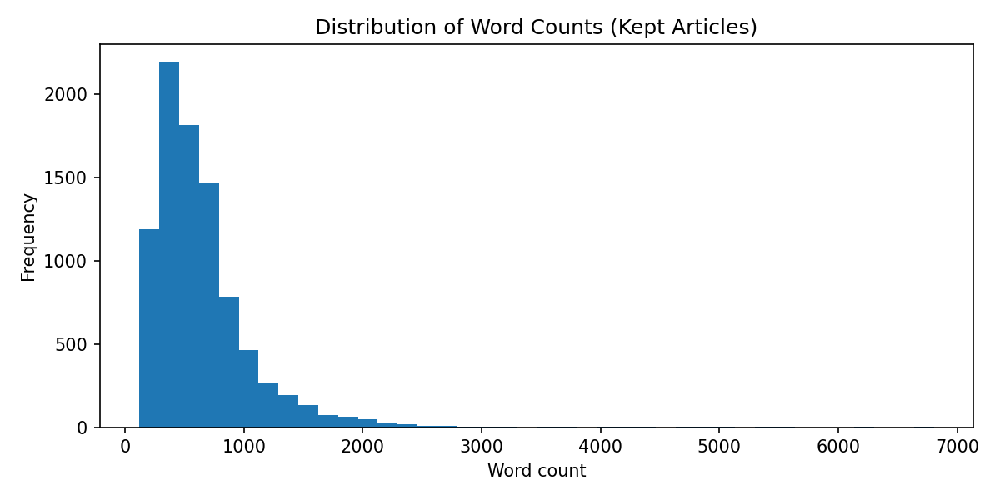{.appendix-figure}

## Top Sources in the Kept-Article Corpus {.appendix-figure-slide}

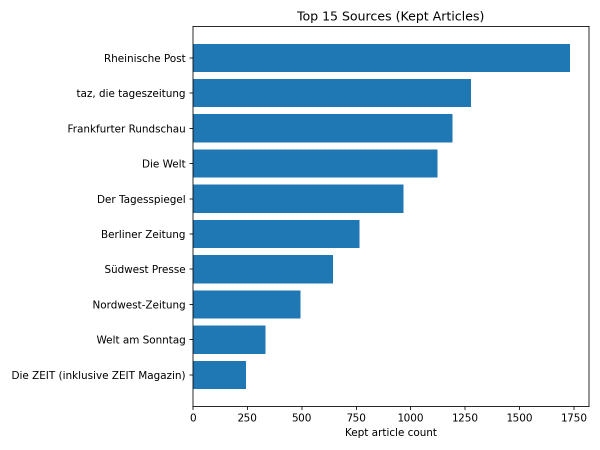{.appendix-figure}

## Monthly Negative Tone Intensity Over Time {.appendix-figure-slide}

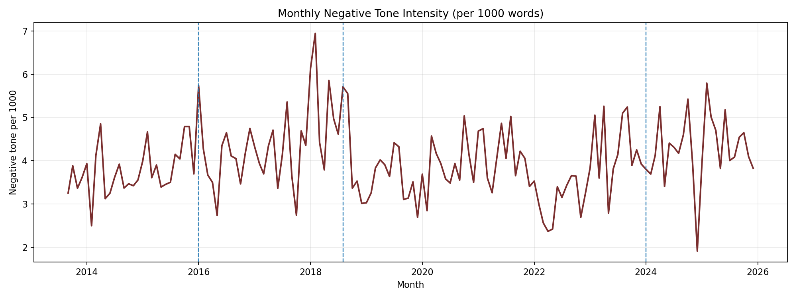{.appendix-figure}

## Monthly Net Tone Score Over Time {.appendix-figure-slide}

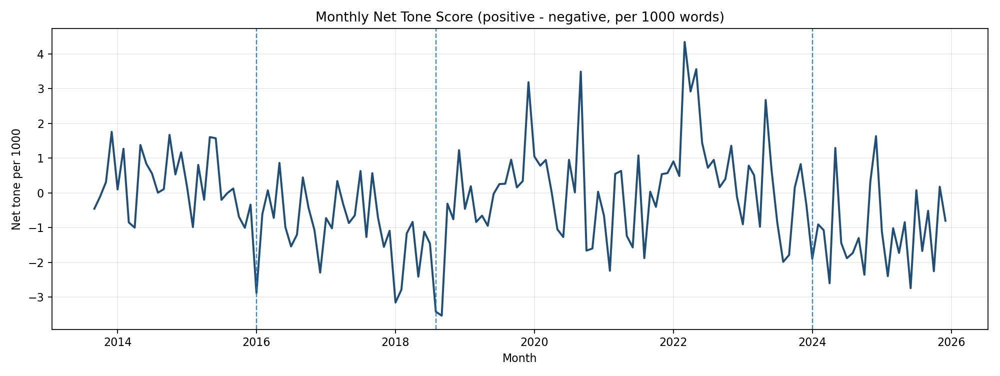{.appendix-figure}
